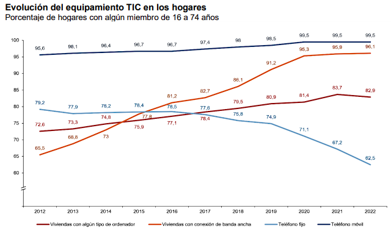

# Descripción del Proyecto

En esta sección, se proporcionará una visión general del proyecto en cuestión, destacando sus objetivos, alcance y contexto general.

- Con este proyecto se pretende desarrollar una aplicación que se basará en el almacenamiento, gestión y visualización de las transacciones monetarias que pueden existir en el día a día de un usuario, estos comprenderán tanto los gastos como los ingresos.
- La aplicación simplemente permitirá llevar un orden con nuestras cuentas, informándonos de todas las transacciones que llevamos y llevando un control sobre el flujo de nuestro dinero.
- La aplicación busca incorporarse de forma similar a las ya existentes en el mercado, diferenciándose en el apartado visual e intentando ofrecer una interfaz más simplificada y cómoda, así como en las funciones que ofrece, intentando requerir la mínima cantidad de datos del usuario como sea posible.

## Justificación del Proyecto

En este apartado, se argumenta la razón y necesidad detrás del proyecto. Se explican los problemas o desafíos que se abordarán y por qué es relevante llevar a cabo el proyecto.

- La motivación para desarrollar este proyecto se basa en la creciente popularidad del uso de aplicaciones informáticas para mejorar la calidad de vida y simplificar acciones comunes. Este software intentará ofrecer una solución sencilla que se ofrezca como sustituto a otras opciones más anticuadas.
- Los principales problemas que la aplicación abordará será adaptarse al perfil de un usuario poco experimentado, por lo cual se tendrá que desarrollar de forma que únicamente necesite pequeñas entradas de datos por parte del utilizador, encargándose la aplicación de la mayor parte del trabajo.
- La finalidad del software será, en resumen, proponer una aplicación que cumpla con sus funciones de manera simplificada, siendo accesible para cualquier público.

## Estudio de Necesidades

En este apartado, se analizan en detalle las necesidades que el proyecto pretende satisfacer. Se pueden incluir datos o investigaciones que respalden la identificación de estas necesidades.

- La necesidad principal de esta aplicación se sitúa en los usuarios con poca experiencia, donde aún prefieren utilizar métodos tradicionales como el papel en lugar de aplicaciones informáticas por desconocimiento o falta de entendimiento, e incluso aquellas personas que se están introduciendo actualmente a estos dispositivos, puesto que existe un incremento en el la demanda del software, habiendo cada vez más usuarios utilizando dispositivos inteligentes como el siguiente estudio del Instituto Nacional de Estadística indica:

  

## Personas Destinatarias

En esta sección, se describe el grupo de personas o entidades a las que está destinado el proyecto. Se proporciona una comprensión de quiénes se beneficiarán directa o indirectamente de sus resultados.

- El proyecto se dirige, como dicho anteriormente, a aquellos grupos de población los cuales se están introduciendo a las aplicaciones móviles o que aún no lo han hecho. Se busca proporcionar una solución que ayude a llevar las cuentas de estos usuarios, simplificando esta tarea cotidiana y permitiendo ahorrar tiempo para otras cosas, asegurando además que estos registros no se perderán como lo podría hacer una agenda común.

